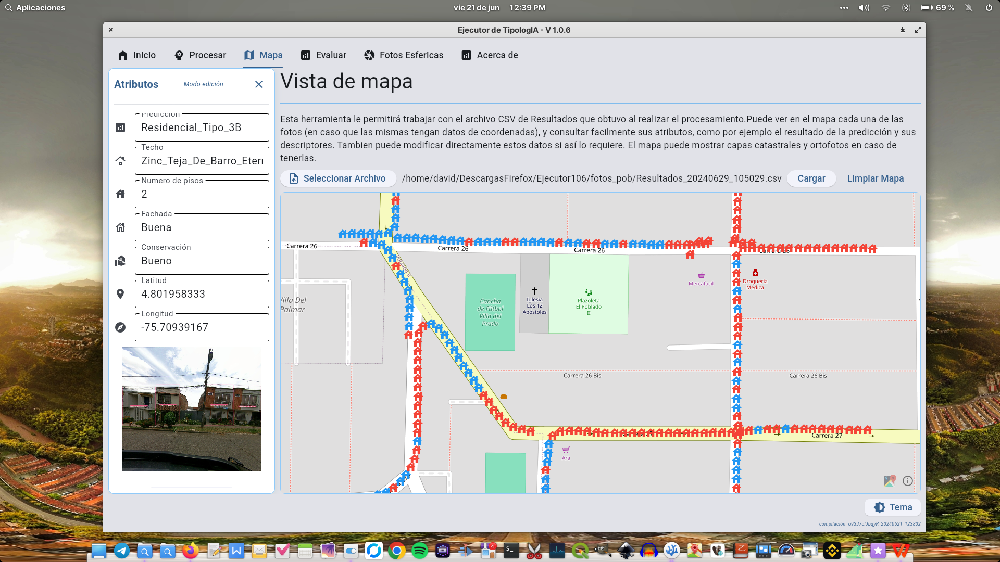

# Ejecutor de TipologIA

[](https://www.youtube.com/@consultoriases)
[](t.me/sesmaps)


> [!IMPORTANT]
> **Versión del programa Ejecutor TipologIA:** 1.0.6 <br>
> **Changelog :**  
> Obtenga solo la tipologia constructiva o incluir tambíen los descriptores <br>
> Cálculo de las matrices de confusión para los descriptores <br>
> El archivo "Resultados" contiene una columna que le permitirá ver en un pop-up el resultado de la imagen predicha <br>
> Nueva pestaña de mapa, para ver los resultados directamente en el ejecutor. Vea los datos según el modelo LADM_Col


> [!NOTE]
> **Año de creación:** 2023
> **Fecha de último cambio:** 21/06/2024


> [!TIP]
> **Autores:** David Vásquez & Juan Restrepo <br>
>**En** Consultor SES. 


> [!CAUTION]
> **Derechos de autor reservados:** 
> Copyright ©2023 - 2024. David Vásquez, Juan Restrepo. Registrado en Dirección Nacional de Derechos de Autor

## Descripción

El Ejecutor de tipologIA es la primer herramienta de inteligencia artificial para reconocimiento catastral en Colombia, esta le  permitirá a los Gestores/Operadores Catastrales del país, procesar por grandes cantidades de imagenes de construcciones, para realizar la clasificación de la tipología constructiva, y sus respectivos descriptores, como por ejemplo:
>1. Estado de conservación
>2. Número de pisos
>3. Estado de la fachada
>4. Material del techo

El ejecutor también extrae las coordenadas de la imagen (en caso de e tenerla), lo cual facilitará la visualización de los resultados en software [SIG](https://qgis.org/).
El resultado es un archivo de texto plano compatible con el modelo de levantamiento de datos LADM-COL. con el resultado de la clasificación para cada una de las imágenes.<br>
Ejecutor de tipologIA, incluye la posibilidad para procesar imágenes panorámicas 360 [PhotoSphere](https://en.wikipedia.org/wiki/Panorama), las cuales conocemos generalmente como StreetView o recorridos virtuales.
Para finalizar hemos incorporado la utilidad que le permite evaluar la precisión de nuestro modelo de inteligencia artificial [TipologIA](https://consultoriases.com/inteligencia-artificial-catastro/) para el municipio en que decida ejecutarlo


---

## Soluciones para Catastro

Diseñamos productos y servicios especializados que simplifican el reconocimiento catastral en Colombia, optimizan los procesos de conservación catastral y facilitan la difusión de información. Nuestra prioridad es garantizar la interoperabilidad de los datos, asegurando una integración fluida con diversas entidades. Con enfoque en la eficiencia y precisión, proporcionamos soluciones tecnológicas que potencian la gestión integral de la información catastral.
>1. Visores web geográficos
>2. Imágenes 360 panorámicas
>3. Imágenes drone oblícuas
>4. Ortofotos
>5. Inteligencia Artificial para reconocimiento predial

---


## Adquirir el programa
> [!IMPORTANT]
>  La solución de Inteligencia Artificial para para Catastro que ofrecemos consta de dos programas:
>El primero es Entrenador, el cual le permitirá reentrenar nuestro modelo de inteligencia artificial TipologIA para ajustarlo a sus necesidades<br>
>El Segundo es el Ejecutor, el cual es el programa de escritorio (Linux/Windows), que le permitirá realizar las clasificaciones.<br>
>Por lo que al comprar TipologIA recibirá ambos programas más lo siguiente:<br>
> 1. Código fuente de los programas
> 2. Documentación del programa
> 3. Manuales de usuario
> 4. Ejecutables
> 5. Modelo de conocimiento
> 6. Transferencia de derechos patrimoniales de tipologIA

> [!TIP]
> Con TipologIA by SES, puede ahorar hasta un 80% en los costos de actualización catastral al año para su municipio.<br>
> Otros beneficios:<br>
> 1. No requiere licencias o suscripciones con pagos periodicos
> 2. No requiere registros de usuario para su uso
> 3. Instale el programa en cuantos equipos quiera
> 4. Modificar el código fuente según sus necesidades
> 5. No es necesario contar con internet para procesar con el programa
> 6. Los resultados se guardan en archivos CSV, JPG y PNG, lo que lo hace completamente interoperable con otros sistemas
> 7. No tiene clausulas abusivas para su uso
> 8. Al comprarlo, puede usarlo a perpetuidad


> [!NOTE]
> 쮺칩mo acceder al programa?:<br>
> Pongase en contacto con nosotros y programemos la videoconferencia<br>
> **Celular:** +57 305 439 2506<br>
> **Correo:** [ses@workmail.com](mailto:ses@workmail.com)<br>
> **Página Web:** [consultoriases.com](https://consultoriases.com)


---
## Así es el Ejecutor de TipologIA




## Conoce más sobre  *TipologIA by SES*
<table>
<tr>
<td width="50%">
<h3 align="center">Usando Ejecutor en Windows</h3>
<div align="center">
<a href="https://www.youtube.com/watch?v=qWgsePWo7zc" target="_blank"></a>
<p>
<a href="https://www.youtube.com/watch?v=qWgsePWo7zc" target="_blank">

</a>
</p>
<p>TipologIA: Nuestra inteligencia artificial pionera en reconocimiento catastral, capaz de identificar y categorizar las diferentes tipologías constructivas con precisión. ¡Una verdadera revolución en el mundo del catastro multipropósito! 🏘 Completamente compatible con el modelo de datos LADM-COL🤖</p>
</div>
</td>
<td width="50%">
 <br>
<h3 align="center">Presentación de TipologIA</h3>
<div align="center">
<a href="https://youtu.be/G88yQz17ZlY?si=qJaARu-sb6pxYnQd&t=2205" target="_blank"></a>
<br>
<p>
<a href="https://youtu.be/G88yQz17ZlY?si=qJaARu-sb6pxYnQd&t=2205" target="_blank">

</a>
</p>
</p>Presentación detallada de TipologIA, nuestra IA para reconocimiento catastral. Descubre cómo esta tecnología revoluciona el catastro multipropósito y se integra perfectamente con el modelo de datos LADM-COL.</p>
</div>
</table>
</div>
<br>

## Para desarrollo sigue estos pasos:

Para utilizar esta herramienta, siga estos pasos:

1. Clona el repositorio:
    ```sh
    git clone https://github.com/SESMAPS/Tipologia.git
    ```

2. Navega al directorio del proyecto o abre la carpeta con tu IDE:
    ```sh
    cd Tipologia

> [!IMPORTANT]
> El Env debe crearse dentro de la carpeta clonada:   ```
3. Crea el Entorno Virtual de Python (abre la terminal): 

    Linux
    ```sh
    python3 -m venv tipologia
    source tipologia/bin/activate
    deactivate #solo usar para salir del entorno
    ```
    Si está en windows 11:
    ```sh
    python -m venv tipologia
    .\tipologia\Scripts\activate
    deactivate #solo usar para salir del entorno
    ```
4. Abre tu IDE en el directorio del proyecto
   Instala las dependencias (tiene que estar dentro del env creado):
    ```sh
    pip install -r requerimientos.txt
    ```
    Si está en windows 11:
    ```sh
    pip install -r requerimientos.txt
    ```
    Y Comprueba que todas las dependencias se instalaron:
    ```sh
    python Comprobador_dependencias.py
    ```

5. Para ejecutar el programa desde tu IDE abre el main_windows.py:
    o desde el terminal
    ```sh
    python inicio.py
    ```
   

---

---

## Contribución

Si deseas contribuir a este proyecto, por favor sigue los siguientes pasos:

1. Haz un fork del repositorio.
2. Crea una nueva rama (`git checkout -b feature/nueva-funcionalidad`).
3. Realiza tus cambios y haz commit (`git commit -am 'Añadir nueva funcionalidad'`).
4. Haz push a la rama (`git push origin feature/nueva-funcionalidad`).
5. Abre un Pull Request.

---

## Licencia

Este proyecto está bajo la licencia de [Consultoria SES](https://consultoriases.com).

---
